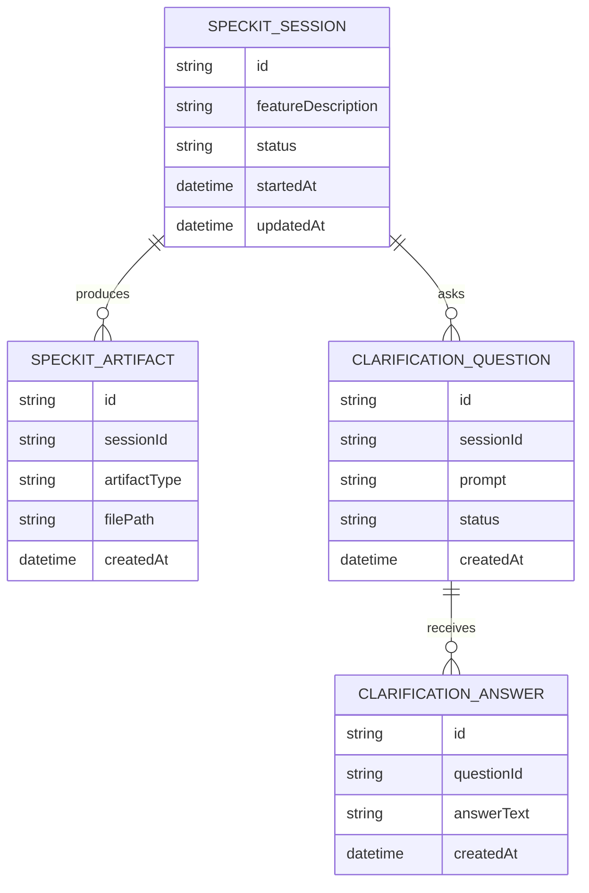
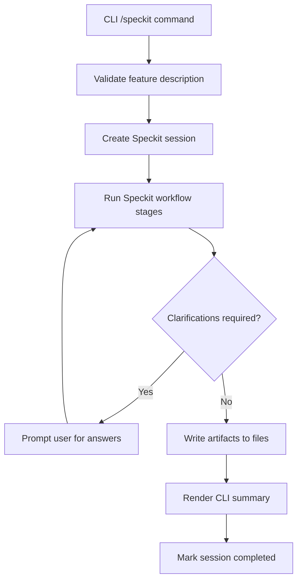

# Data Model: Speckit CLI Command

**Date**: 2025-12-19  
**Project**: Codebuff CLI  
**Detected Stack**: Bun + TypeScript, React/OpenTUI (CLI), filesystem persistence (no database)

## Table of Contents

- [Database Schema (Logical)](#database-schema-logical)
- [Service Layer Models](#service-layer-models)
- [UI Data Structures](#ui-data-structures)
- [End-to-End Data Flow](#end-to-end-data-flow)
- [Data Validation Strategy](#data-validation-strategy)
- [Notes and Considerations](#notes-and-considerations)

## Database Schema (Logical)

The workflow persists artifacts to the filesystem. The following logical schema documents the data required and relationships for reliable workflow behavior.



### Table Definitions

#### speckit_sessions

- **id** (uuid, PK)
- **feature_description** (text, required)
- **status** (enum: `running`, `waiting_for_clarification`, `completed`, `cancelled`, `failed`)
- **started_at** (timestamp, required)
- **updated_at** (timestamp, required)

Indexes: `status`, `started_at`

#### speckit_artifacts

- **id** (uuid, PK)
- **session_id** (uuid, FK → speckit_sessions.id)
- **artifact_type** (enum: `spec`, `clarify`, `plan`, `tasks`, `implementation`, `review`, `summary`)
- **file_path** (text, required)
- **created_at** (timestamp, required)

Indexes: `session_id`, `artifact_type`

#### clarification_questions

- **id** (uuid, PK)
- **session_id** (uuid, FK → speckit_sessions.id)
- **prompt** (text, required)
- **status** (enum: `open`, `answered`, `skipped`)
- **created_at** (timestamp, required)

Indexes: `session_id`, `status`

#### clarification_answers

- **id** (uuid, PK)
- **question_id** (uuid, FK → clarification_questions.id)
- **answer_text** (text, required)
- **created_at** (timestamp, required)

Indexes: `question_id`

## Service Layer Models

### Request / Response DTOs

```ts
export interface StartSpeckitRequest {
  featureDescription: string
}

export interface StartSpeckitResponse {
  sessionId: string
  status: 'running' | 'waiting_for_clarification' | 'completed' | 'failed'
  summaryPath?: string
}

export interface ClarificationPrompt {
  questionId: string
  prompt: string
}

export interface SubmitClarificationsRequest {
  sessionId: string
  answers: Array<{ questionId: string; answerText: string }>
}

export interface CancelSpeckitRequest {
  sessionId: string
  reason?: string
}
```

### Domain Models

```ts
export interface SpeckitSession {
  id: string
  featureDescription: string
  status: 'running' | 'waiting_for_clarification' | 'completed' | 'cancelled' | 'failed'
  startedAt: string
  updatedAt: string
}

export interface SpeckitArtifact {
  id: string
  sessionId: string
  artifactType: 'spec' | 'clarify' | 'plan' | 'tasks' | 'implementation' | 'review' | 'summary'
  filePath: string
  createdAt: string
}
```

### Business Rules

- A session moves to `waiting_for_clarification` when at least one open clarification question is generated.
- A session can only be cancelled by explicit user confirmation.
- Artifacts are immutable after creation; repeated runs create new artifacts under a new session.
- A CLI summary is produced for every completed or cancelled session.

## UI Data Structures

```ts
export interface SpeckitCommandInput {
  rawInput: string
  featureDescription: string
}

export interface SpeckitWorkflowState {
  sessionId: string
  status: 'idle' | 'running' | 'awaiting_clarification' | 'completed' | 'cancelled' | 'failed'
  currentStage: 'specify' | 'clarify' | 'plan' | 'tasks' | 'implement' | 'review' | 'done'
  prompts: ClarificationPrompt[]
  lastMessage?: string
}
```

## End-to-End Data Flow



**Flow Example**: A user runs `/speckit add onboarding flow`. The command validates the input, creates a session, runs the workflow, pauses for clarification questions, resumes after answers, writes `spec.md`, `plan.md`, and `tasks.md` files, then displays a CLI summary with artifact locations.

## Data Validation Strategy

- Validate that the feature description is non-empty and within a reasonable length limit before starting.
- Require each clarification answer to map to a known question ID.
- Prevent session cancellation without explicit confirmation.
- Validate artifact file paths to remain within the feature workspace.

## Notes and Considerations

- Performance: initial response should return quickly (<30 seconds) even for long workflows.
- Security: do not persist sensitive tokens or credentials in artifact files.
- Reliability: allow resuming after clarification without losing prior artifacts.
- Future changes: add new artifact types without breaking existing summaries.
